# Project 1: Personal web page
***[Murky, Baby Murloc](https://murkyy.uk.r.appspot.com/html/trivia.html)***
## Description
The website is collection of informational pages about game character, Murky, Baby Murloc. The color template and theme are also related to the Murky, thus the site is noisy and chaotic.

## Components
- A landing page. It lets people know what the site is about *Murky, Baby Murloc* and contain the necessary links such as background, data, trivia and trailer. Also, there is a header bar as a navigation for people to get around the site.
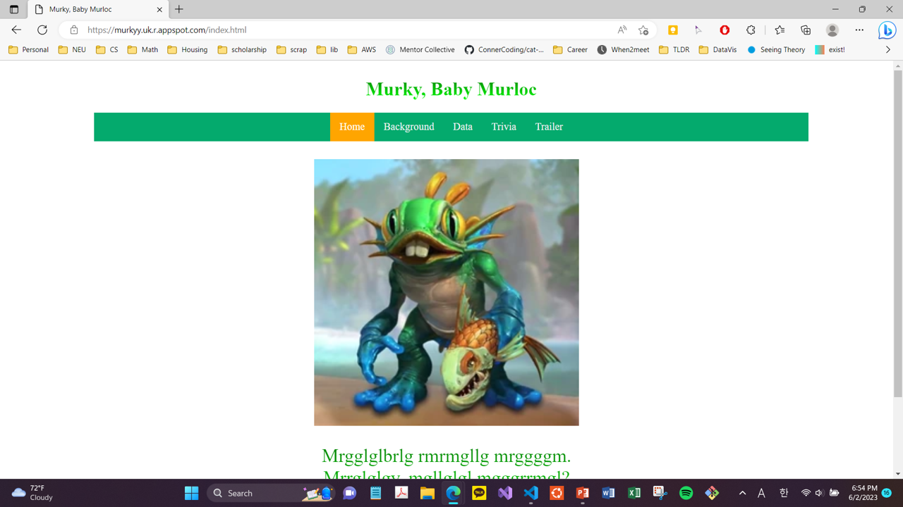

- Header bar as a navigational element clearly guiding where user can go. There are no dead ends and the user does not have to resort to the browser's navigation buttons to get where they want to go. The header bar does not scroll out of sight as you can compare above image and below image . Also, it does not disappear when the window is resized. You can check it with images in the last bullet point. Color and positioning of the navigational elements are styled in CSS.
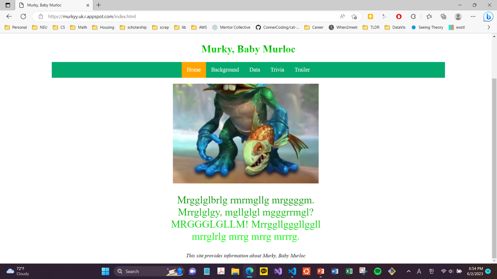

- Four internal links: Home, Background, Data, and Trivia pages. These links to separate pages within the site. The styling of the internal links match the styling of the rest of the site, and the navigational element is present. Every Internal links opens their content in the same browser tab as the site is being viewed in.
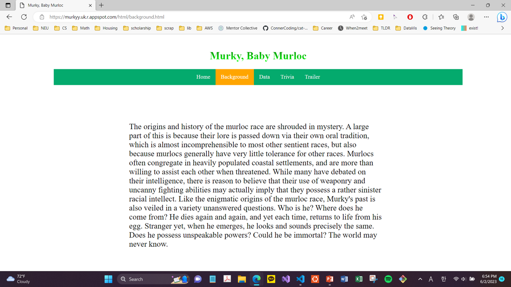
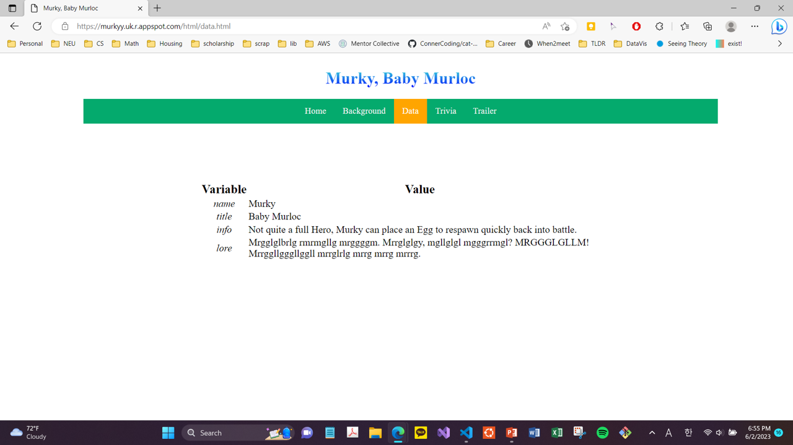
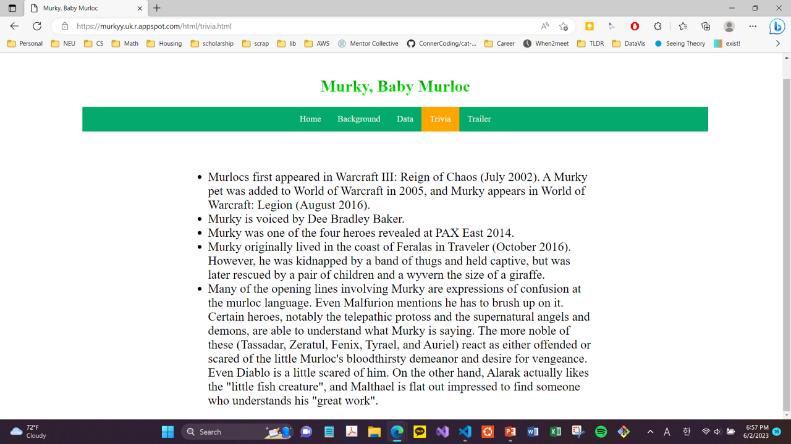
- One external link which is *Trailer* page. It opens new browser tabs so that the site remains open in the user's browser. You can see that two tabs are opend.
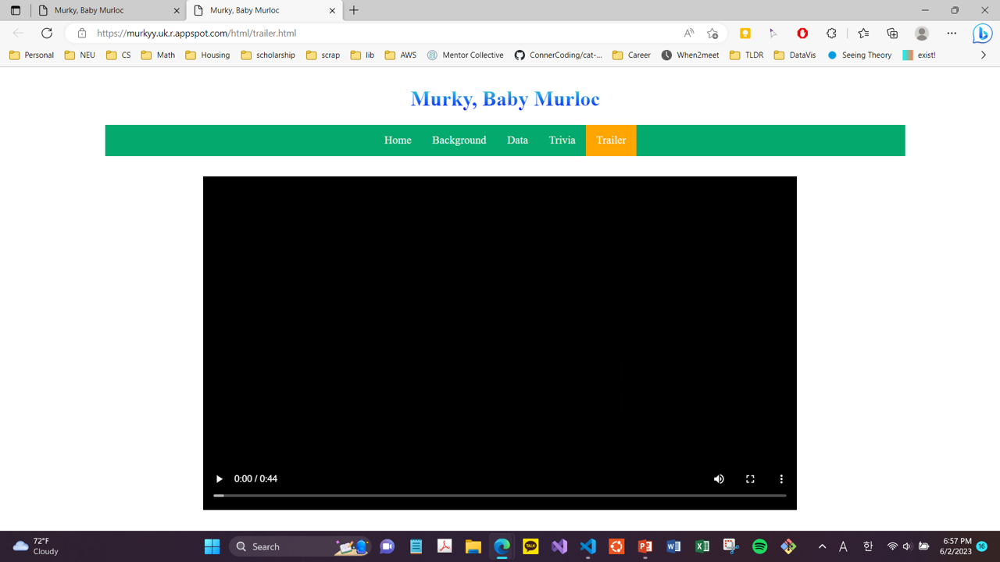

- HTML table, with CSS styling is implemented in *Data* page.

- Audio play and headbar highlighting as interactive components and animated text. At *Home* page, clicking on image plays and stops audio. Also, title and some text change its color by time.
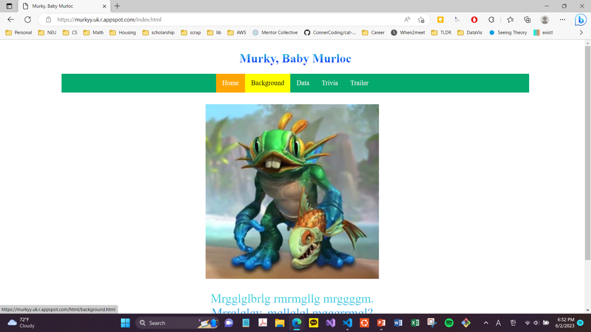
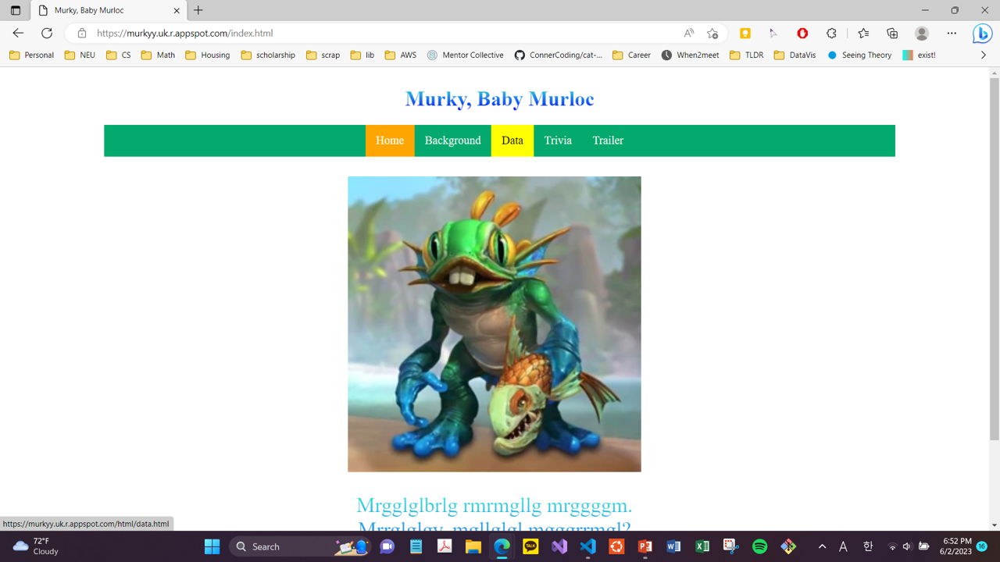
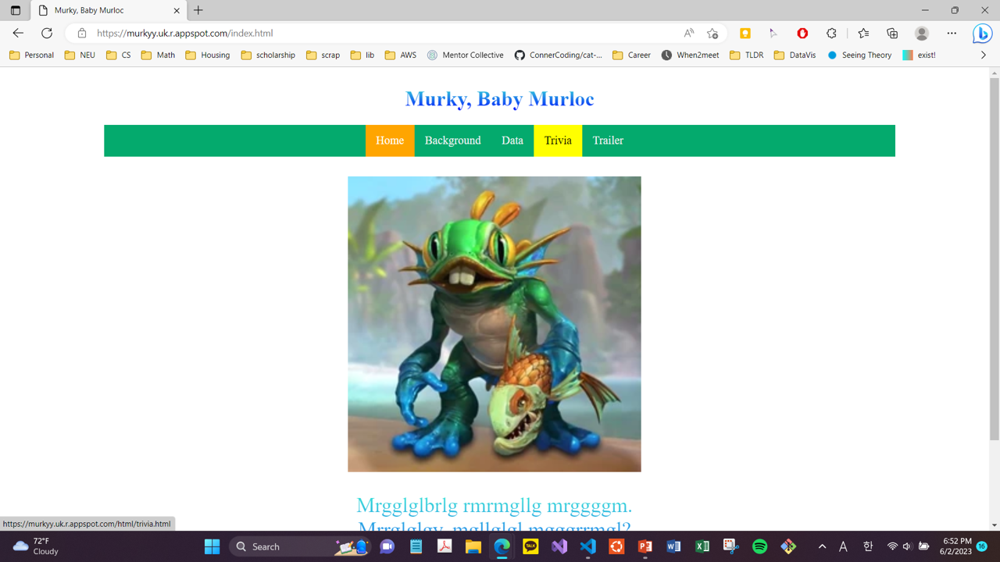
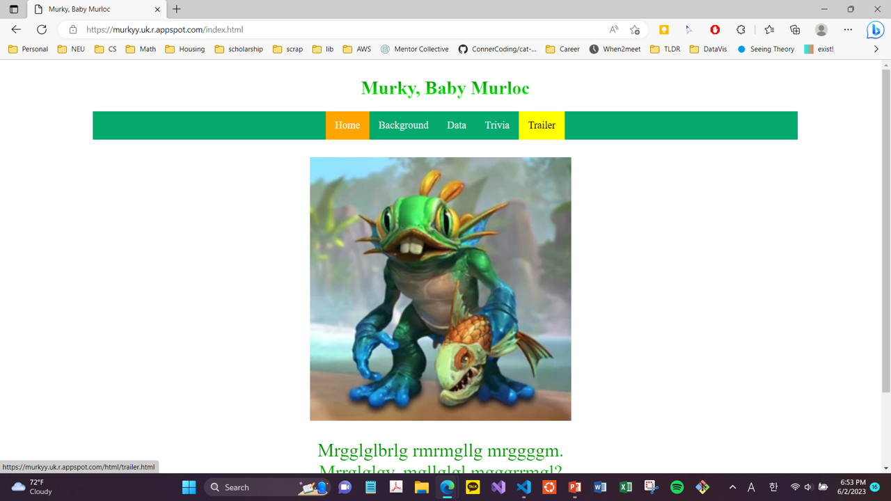
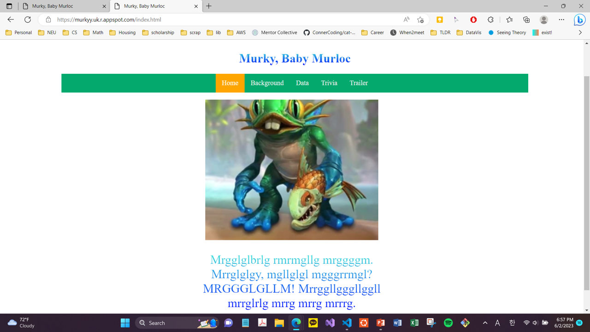
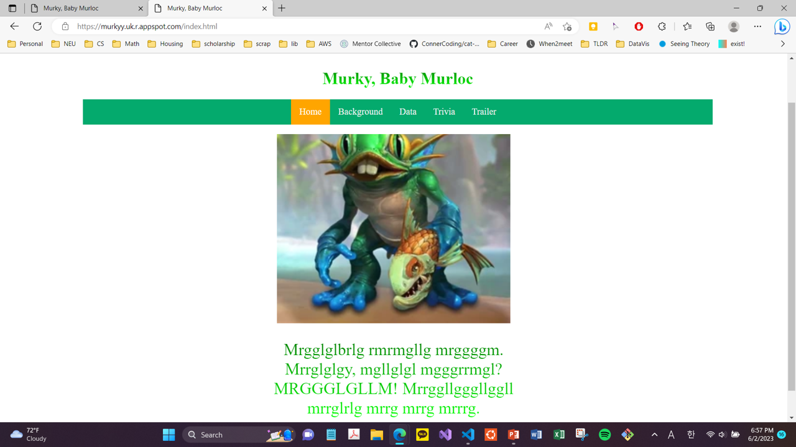

- My site should behave in a reasonable way when viewed on a desktop in a browser, and on a mobile device.

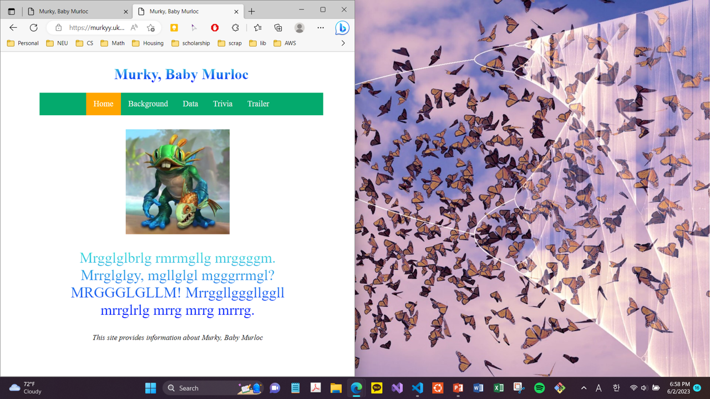
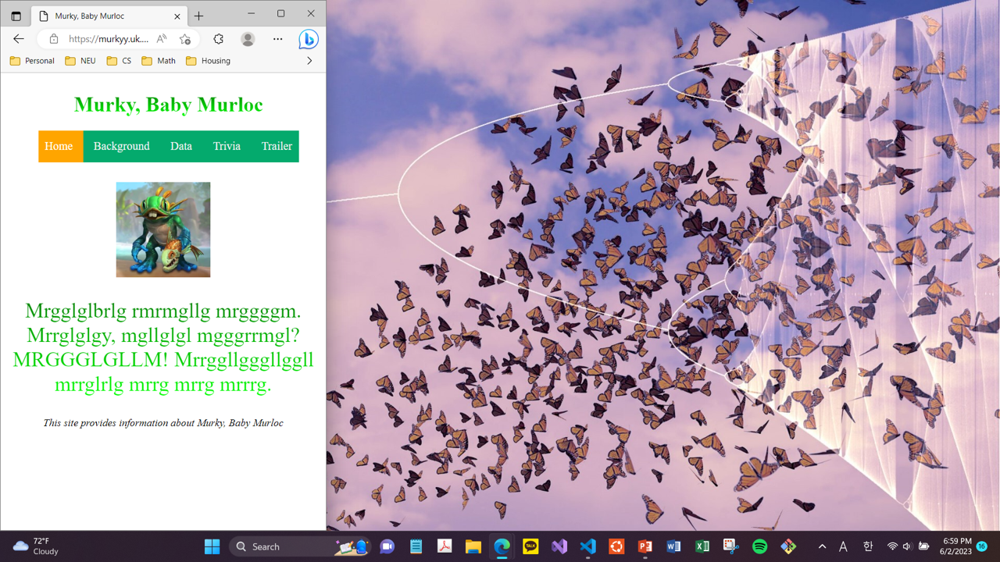
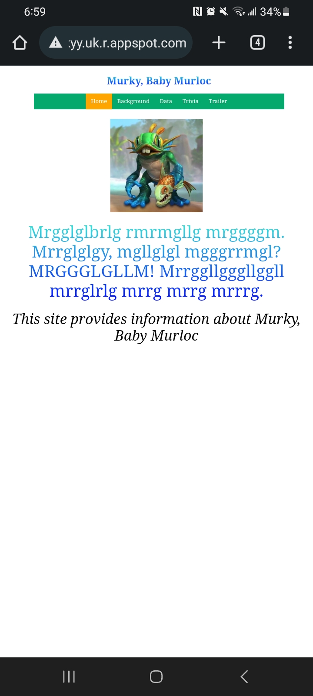